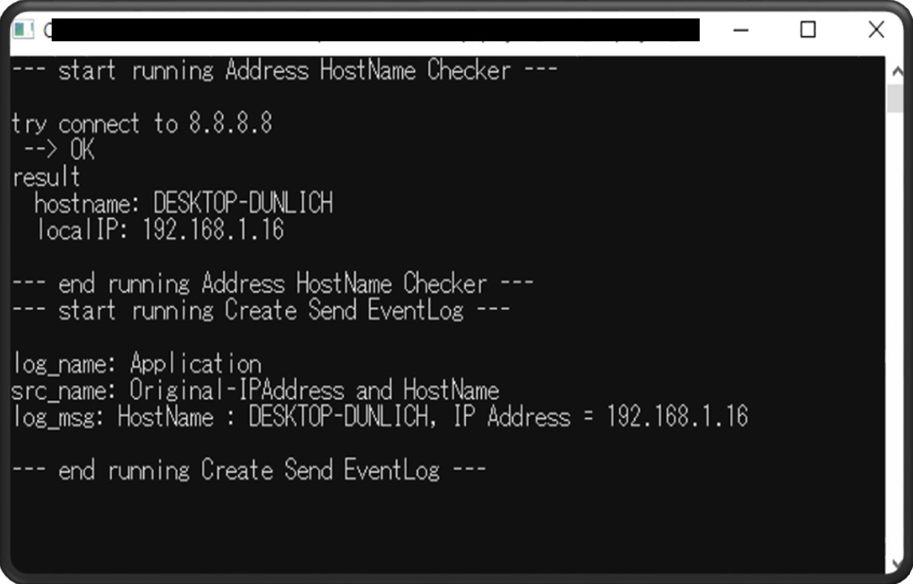
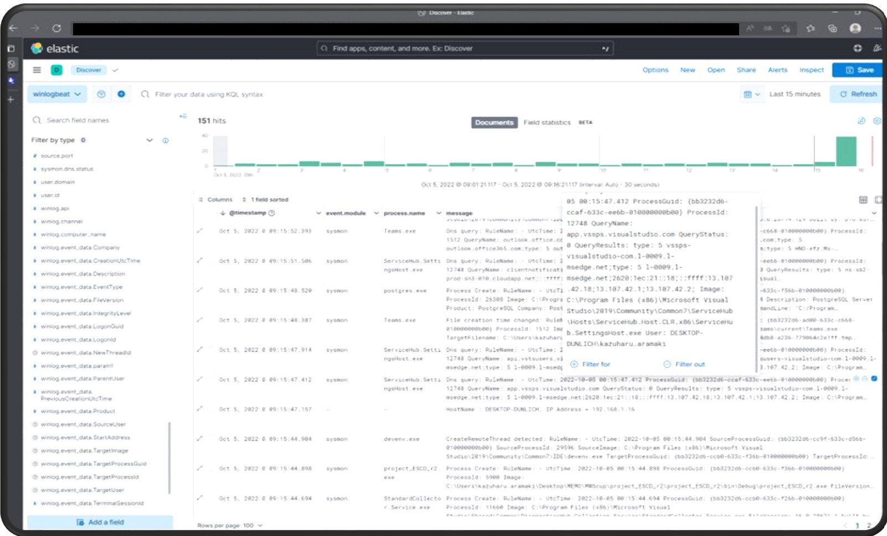

## doroka
このリポジトリはシステムdorokaのソースコードです。

## Description
- **doroka**はIPアドレスと​ホスト名を紐づけた情報を独自Windowsイベントログとして生成し、
ElasticSearchで他システムログ含めて可視化するシステムです。
- IPアドレスと​ホスト名を紐づけた情報によって、インシデント発生時に​端末特定が​スムーズになります。
- システム環境（使用したオープンソース）
  - Docker
  - ElasticSearch
  - kibana
  - winlogbeat
  - sismon ※相関分析用の他ログとして採用しています。システムの主旨から必須ではありません。
  - .NET Framework, socket
  - WindowsAPI(EventLog)

## Visuals
システムの実行イメージです。



## Installation
### 必要環境の準備
- このシステムは以下環境で動作確認済みです。※サーバはWindows上でVMを立てて確認しています。
  - サーバー側：Ubuntu 20.04.1 LTS (Focal Fossa)　にDockerコンテナでElasticSearch, Kibanaを構築しています。
    - ElasticSearch dockerimage：docker.elastic.co/elasticsearch/elasticsearch:8.4.2
    - kibana dockerimage：docker.elastic.co/kibana/kibana:8.4.2
  - 端末側：Microsoft Windows 10 (Enterprise)

### サーバー側の準備
1. Dockerをインストールします。以下公式ドキュメントにしたがってインストールしてください。
<br>[Ubuntuにdockerにインストール](https://docs.docker.jp/desktop/install/ubuntu.html)

1. サーバーの適当なワークディレクトリを作成し、レポジトリ上の`docker`内にある`docker-compose.yml`と`elasticsearch.yml`を配置します。

1. ワークディレクトリ上で、以下コマンドでdockerコンテナを起動します。
```
sudo docker compose up -d
```
<br>※コンテナがメモリ不足でエラーが発生する場合は、以下コマンドでメモリ上限を設定して再度実行してください。
```
sudo sysctl -w vm.max_map_count=262144
```

1. ブラウザから `http://{サーバーアドレス}:5601` にアクセスし、kibanaのメイン画面が表示されれば正常です。

### 端末側の準備
1. winlogbeatを以下公式ドキュメントにしたがってインストールしてください。
<br>[winlogbeat_v8.4.2](https://www.elastic.co/guide/en/beats/winlogbeat/current/winlogbeat-installation-configuration.html)

1. インストールしたwinlogbeatのディレクトリ内にある`winlogbeat.yml`をリポジトリの`winlogbeat/winlogbeat.yml`に置き換えてください。

1. `winlogbeat.yml`の115行目について、`{server address}`をサーバ側のアドレスに変更してください。
```
  hosts: ["{server address}:9200"]
```

1. インストールしたwinlogbeatのディレクトリ上で、以下コマンドで、winlogbeatを管理者権限で実行してください。
<br>eventlogをサーバ側へ定期的に送信しているログが表示されれば正常です。
```
./winlogbeat -c winlogbeat.yml -e
``` 

1. 適当なワークディレクトリを作成し、リポジトリ内のdoroka.exeを配置してください。

## Usage
### 端末側でEventLogを生成し、送信
1. doroka.exeを管理者権限で実行してください。
<br>Windows Event Viewerを開き、Windowsログ-アプリケーションにEventLogがエントリされていた正常です。
```
./doroka
```

### サーバ側で端末のEventLogを一元的に確認
1. ブラウザから `http://{サーバーアドレス}:5601` にアクセスし、winlogbeatが送信したEventLogが確認できます。

## Roadmap
### 本システムのC#スクリプトを機能拡充
- 独自の検知、情報でWindow EventLogを生成する機能
- 他EventLogとの相関分析を端末側スクリプトで行い、結果をサーバー側へ送信する機能の実装
